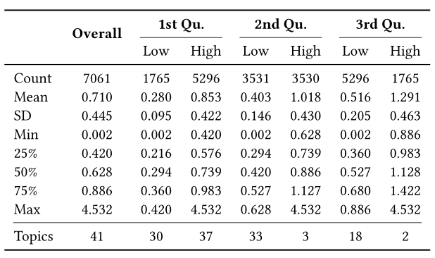

# Analysis of the Gender Pay Gap and Workplace Culture in the Technology Sector

This repository contains data and codes used in three studies.

## Study 1
### Data
We collected and preprocessed salary records from [levels.fyi](https://www.levels.fyi/) to examine the impact of personal attributes on gender wage gaps. The final dataset includes 7,146 software engineer payroll records (SWE), 3,601 senior software engineer records (Senior SWE and managers), and 585 data scientist records (DS). We ran stepwise multi-variant regression models based on the following factor order:

1. **Gender:** Self-declared gender as men (reference group) or women

2. **Race:** One of four race/ethnicity categories as Asian (reference group), White, two or more, or URM

3. **Education:** Education level as high school graduate, non-BA, B.A., or M.A. & higher (reference group)

4. **Company:** Choice of one of thirteen companies studied (Amazon as a reference group)

5. **Levels:** Normalized levels as SWE (reference group), DS, or Senior SWE

6. **Location:** Workplace location (city, Seattle as a reference group)

7. **Exp.:** The length of total working experience is measured in years

8. **Prop. Exp.:** Proportion of working years in the current company out of all working years

## Study 2
### Data

We collected company review dataset from [Indeed.com](https://indeed.com/) to illustrate our method could bring more insights about online review data comprehension.

 
 

### Three-stage multi-topic modeling and reasoning method

We propose a new multi-topic modeling and reasoning method that uses information theory, generative models, and association rules to identify and interpret topics with high-level labels.

 
 

**Stage 1: Complexity inspection**

We calculate entropy for the overall corpus and by different entropy quantiles as follows:

 

The top 10 words with the highest probability tend to have less information in a company context.

 

Reviews with low entropy are characterized by a relatively focused topic and shorter length, as exemplified by the following example with an entropy value at the mean of the first quantile:

*"Pros: There are lots of opportunity to connect with others on different teams if you want to move around. Cons: Teams are global and sometimes hard to reach." (Entropy: 0.284)*

Reviews with higher entropy, on the other hand, tend to contain a greater amount of information, making it more difficult to distill an overall topic into a single label. An example review, with an entropy value at the mean of the third quantile, is as follows:

*"Projects in [Company] are very poor and management does not have a clue in what they are doing in some projects. Pros: Good leave policies; Flexible work; Good work life. Cons: Projects are poor; Not very good management in some project level." (Entropy: 0.541)*

For the following analysis, we used the first quantile (0.420) as the threshold to partition the corpus into a low- and a high-entropy two dataset to conduct stage 2 and stage 3 analyses, respectively.

**Stage 2: Single-topic discovery**

After partitioning the corpus into low- and high-entropy parts based on entropy, we identified 14 topics that have been mainly discussed on this website based on low-entropy data.

 
 

 **Stage 3: Multi-topic logic rule reasoning**

 By calculating the distances to fitted topic clusters for high-entropy data, we assign multiple topics based on the first distance quantile, resulting in the following topic distribution:

 
 

 Of the 14 topics that were identified, 385 reviews were assigned to six topics. The example below demonstrates that distance metrics can effectively capture the semantic meanings of these reviews.

 *"[Company] was a wonderful place to work at.(**Workplace Satisfaction**) A typical day consisted of reviewing on going bugs and delivering ways to fix them, as well as committing change lists to improve any systems/applications that were launched in Borg.(**Work schedule, Job Description**) I learned a lot on how [Company] executes business practices in fluid and collaborative ways without getting bogged down in paperwork. The Management Team is highly technical, they could provide feedback for challenging solutions and guidance on how to wrangle them.(**Company management**) [Company]’s workplace culture is collaborative but highly competitive, you always need to bring you "A" game on a daily basis.(**Issues and Criticisms**) The hardest part of the job was trying to manage work life, as the demands for getting projects completed on time were paramount.(**Work-life balance**) My fondest memories for working at [Company] were the SRE members in the flights team. These members were a great bunch to work with."*

Assigning possibly multiple topics to high-entropy data allows us to stimulate association rules among them. We take the two most negative topics (i.e., those with the lowest average ratings) as the consequences, and the first six logical rules for each topic, sorted by confidence in descending order, are presented below.

 
 

Upon visualizing the association rules, we have noticed that the least satisfying two topics (marked in red) are driven by the most positive perspective in the workplace (marked in green).

 
 

 **Ablation Study**

1. Single-topic evaluation

    Although the baseline model BERTopic has downward compatibility in terms of altering the number of topics, the quality of clustering results cannot be guaranteed.

    
 

    In terms of topic representation, generating keyword labels through a LLM from a randomly sampled subset of topic reviews can provide a meaningful and high-level summary of topics.

    
 

 2. Multi-topic threshold effect

    Assigning multiple topics to high-entropy data by using the second distance quantile will result in more rules with more details.

    
 

    
 

    Rule A-50, generated for the "**Contractor Treatment**" topic,expands the topic scope of rule E by including "**Issues and Criticisms**" in the premise, while rule H-50 involves the consideration of "**Work-life Balance**" in the basis of rule G, which suggests that "**Company Management**", "**Contractor Treatment**" and work-life balance issues are likely to result in "**Job Insecurity**". 

## Study 3

This section contains descriptions of the survey data(cleaned_survey_df_share.csv).

### **Question Coding**

*All the survey questions are based on a 4-point scale except for the general question, in which 1 means a positive response.*

***General Question:*** Have you experienced any type of discrimination at work because of your gender?	

***Work-life Balance_1:*** You frequently have an emergency call related to the project when off work.	

***Work-life Balance_2:*** You are facing difficulties balancing work and life as a software engineer.	

***Heavy Workload_1:*** You have too much work to do in the workplace.	

***Heavy Workload_2:*** You enjoy working in situations involving competition with others.	

***Management_1:*** You are satisfied with your current management in the workplace.	

***Management_2:*** You are lacking career prospects because of management.	

***quit_1:*** You are satisfied with your current job.

***women senior_1:***  Your women seniors are extremely competitive in the workplace.	

***women senior_2:***  You feel comfortable working with women seniors.	

***women senior_3:***  Your men seniors are extremely competitive in the workplace.	

***women senior_4:***  You feel comfortable working with men seniors.	

***role model_1:***  You have less access to seniors or role models of the same gender as you in the workplace.

***market value_1:***  Online job platforms help you identify your market value.

***Salary Negotiation_1:***  You are satisfied with your current salary.	

***Salary Negotiation_2:***  You have strong salary negotiation power.	

***Salary Negotiation_3:***  You are willing to negotiate your salary in the future.

### **New Attributes**

*The level of expectation of stereotypical perceptions of senior-level individuals:*

***competitive*** = women.senior_3 - women.senior_1

***comfortable*** = women.senior_4 - women.senior_2

*Overall perception of different workplace cultures:*

***wlb*** = (Work.life.Balance_1 + Work.life.Balance_2)/2

***workload*** = (Heavy.Workload_1 + Heavy.Workload_2)/2

***manage*** = (Management_1 + Management_2)/2

***negotiation*** = (Salary.Negotiation_1 + Salary.Negotiation_2 + Salary.Negotiation_3)/3

## Data Usage Terms

This repository contains data used in three studies only for scientific replication purposes. The shared salary and review data usage should follow the original terms of usage ([levels.fyi](https://www.levels.fyi/about/terms.html) and [Indeed.com](https://www.indeed.com/legal?hl=en)).

